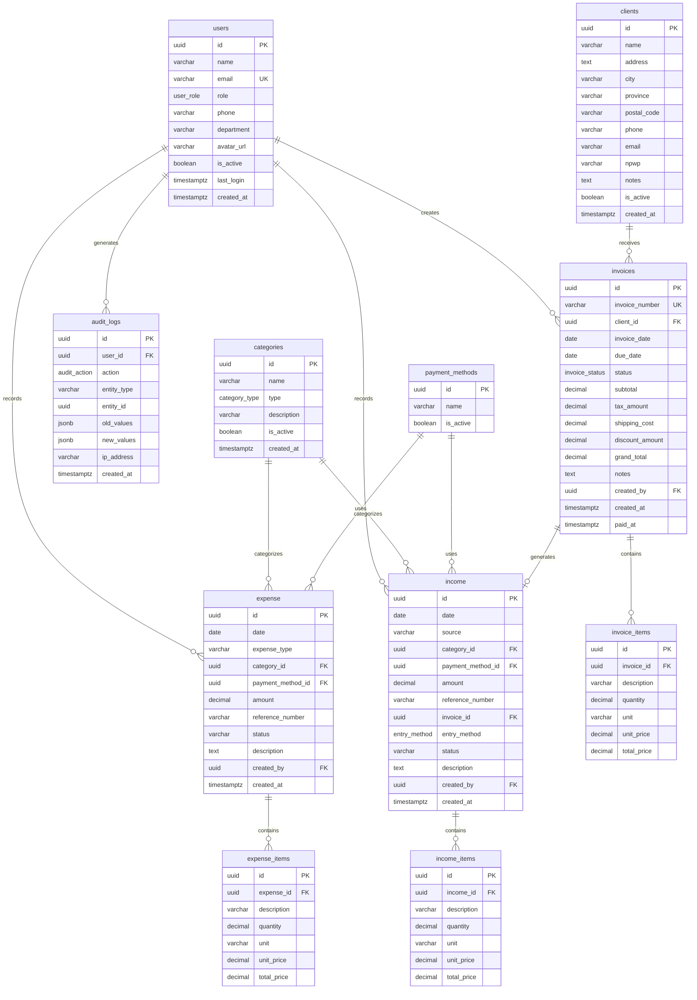
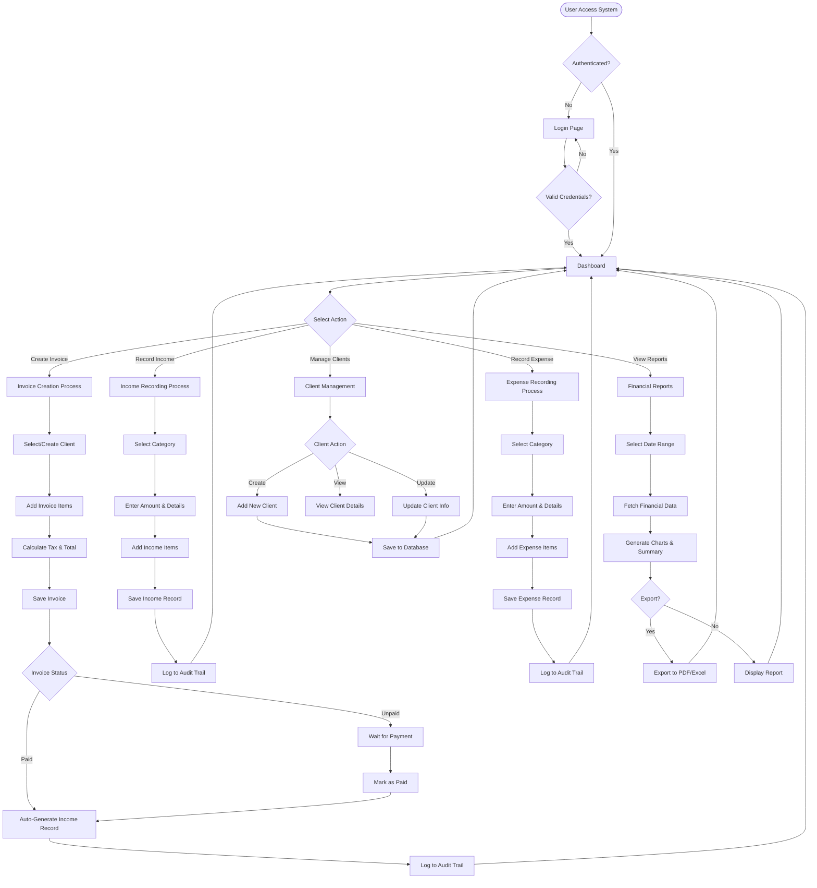
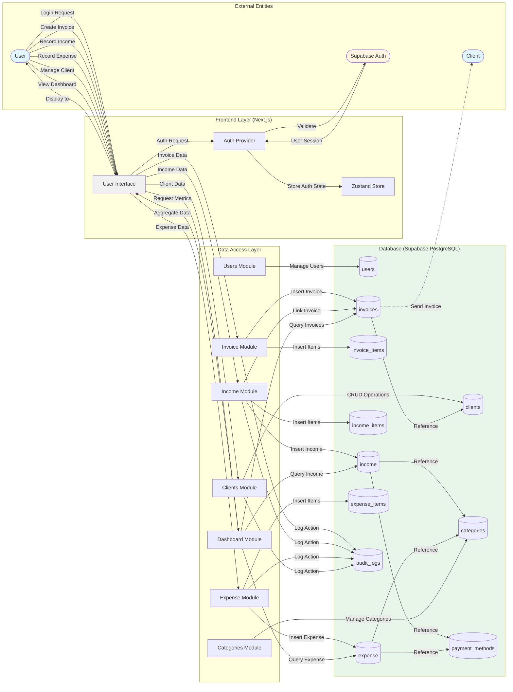

# GMera Solusi - Financial ERP & Dashboard

GMera Solusi is a professional financial management system and ERP dashboard designed for small to medium-sized enterprises. It provides a comprehensive suite of tools for tracking income, managing expenses, generating e-invoices, and monitoring business health through real-time analytics.

## 🚀 Key Features

- **Financial Dashboard**: Real-time KPI tracking for income, expenses, net profit, and unpaid invoices.
- **E-Invoicing System**: Create professional invoices with automatic tax and discount calculations.
- **Income & Expense Tracking**: Detailed logging of transactions with category classification.
- **Client Management**: Maintain a central database of clients with detailed transaction history and stats.
- **Category Management**: Organized transaction classification with drag-and-drop reordering.
- **Notification System**: Live notifications for system activities (paid invoices, new records, etc.).
- **User Management**: Role-based access control and user status management.
- **Audit Logs**: Comprehensive tracking of all critical system actions.

## 🛠 Tech Stack

- **Frontend**: Next.js 16 (App Router), React 19
- **Styling**: Tailwind CSS
- **Database**: Supabase (PostgreSQL)
- **State Management**: Zustand
- **Icons**: Astraicons (Premium Bold & Linear sets)
- **Charts**: Recharts

## 📋 Prerequisites

Before you begin, ensure you have the following installed:

- [Node.js](https://nodejs.org/) (v18 or higher recommended)
- [npm](https://www.npmjs.com/) or [yarn](https://yarnpkg.com/)

You will also need a [Supabase](https://supabase.com/) project set up.

## ⚙️ Installation & Setup

1. **Clone the repository**:

   ```bash
   git clone <repository-url>
   cd "Gmera Solusi"
   ```

2. **Install dependencies**:

   ```bash
   npm install
   ```

3. **Configure Environment Variables**:
   Create a `.env.local` file in the root directory and add your Supabase credentials:

   ```env
   NEXT_PUBLIC_SUPABASE_URL=your_supabase_url
   NEXT_PUBLIC_SUPABASE_ANON_KEY=your_supabase_anon_key
   ```

4. **Database Setup**:
   The database schema and initial seed data are located in the `schema/` directory.
   - Run the SQL scripts in `schema/schema-final.sql` in your Supabase SQL Editor.
   - Run the seed scripts in `schema/seed-final.sql` to populate initial data.

5. **Run the development server**:

   ```bash
   npm run dev
   ```

6. **Open the application**:
   Navigate to [http://localhost:3000](http://localhost:3000) in your browser.

## 📂 Project Structure

- `src/app/`: Next.js pages and layouts (Dashboard, Invoices, Clients, etc.).
- `src/components/`:
  - `layout/`: Navbar, Sidebar, and Page wrappers.
  - `dashboard/`: Dashboard-specific widgets and charts.
  - `ui/`: Reusable primitive components (Button, Modal, Table, etc.).
- `src/lib/db/`: Modularized database access layer (Supabase logic).
- `src/store/`: Zustand state management (Auth, etc.).
- `schema/`: Database migration and seed files.
- `docs/`: Detailed project documentation and technical specifications.

## 📊 System Architecture

### Entity Relationship Diagram (ERD)

The following diagram shows the database schema and relationships between tables:



### System Flowchart

This flowchart illustrates the main business processes in the application:



### Data Flow Diagram (DFD)

This diagram shows how data flows through the GMera Solusi system:



### Data Flow Description

1. **Authentication Flow**: Users authenticate through Supabase Auth, and their session is managed by the Auth Provider and stored in Zustand state.

2. **Invoice Flow**: Users create invoices → Data sent to Invoice Module → Invoice and items saved to database → Audit log created → When marked as paid, income record auto-generated.

3. **Income/Expense Flow**: Users record transactions → Data sent to respective modules → Transaction and items saved → References to categories and payment methods maintained → Audit log created.

4. **Dashboard Flow**: Dashboard requests aggregated data → Dashboard module queries multiple tables (income, expense, invoices) → Data processed and returned → Charts and metrics displayed.

5. **Client Management**: CRUD operations on clients → Client data managed through Clients Module → Referenced by invoices for historical tracking.

6. **Audit Trail**: All critical operations (create, update, delete) are logged to audit_logs table with user information, old/new values, and timestamps.