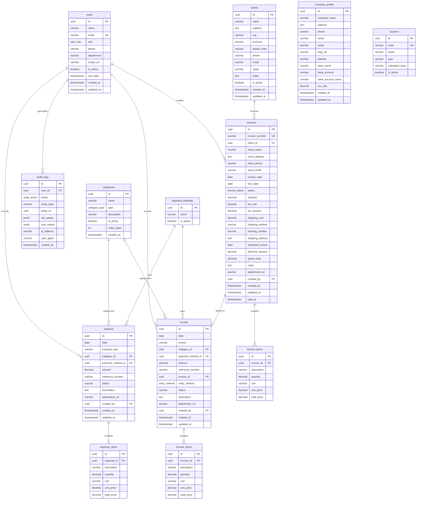
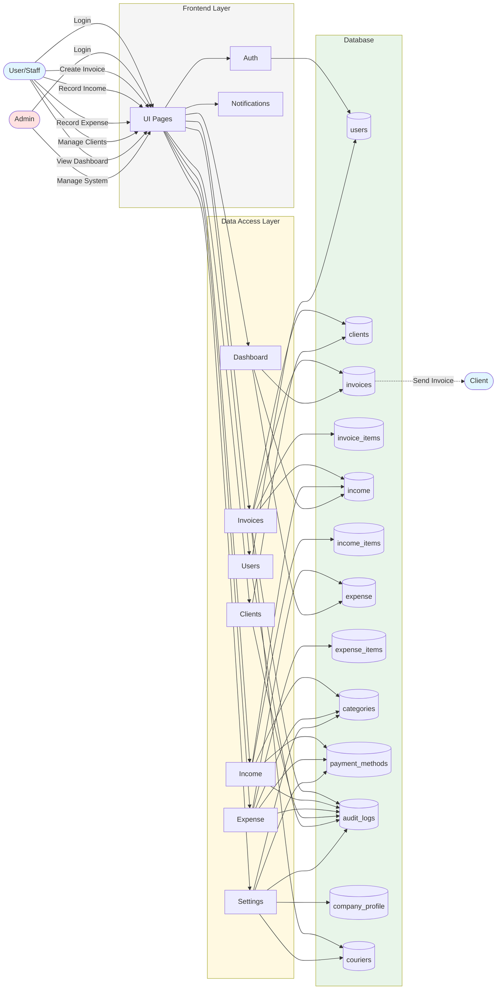

# GMera Solusi - Financial Management System & ERP

> **Research Project**: Web-Based Accounting Information System for Income, Expense, and E-Invoice Management in Manufacturing Company

## 🌟 About This System

This is a **web-based Accounting Information System** developed as a comprehensive solution to address financial management challenges faced by **PT GMera Solusi**, a manufacturing company. The system was designed through academic research using a case study approach to transform their financial operations from manual Excel-based processes to an integrated, automated digital platform.

### 📋 **Background & Problem Statement**

PT GMera Solusi, like many manufacturing companies, faced significant challenges in their financial operations:

1. **Manual Recording Issues**
   - Financial transactions recorded manually using Microsoft Excel
   - High risk of data entry errors and duplicate records
   - Difficulty in data storage, retrieval, and searching
   - Time-consuming process for updating information and generating financial reports
   - User dependency - reliance on specific individuals for financial data

2. **Unintegrated Invoice System**
   - Manual e-invoice creation prone to recording mistakes
   - No centralized system for invoice management
   - Difficult to track invoice status and payment history
   - Challenges in maintaining historical accuracy of client information

3. **Limited Financial Visibility**
   - Lack of real-time financial information for decision-making
   - Difficulty in cash flow monitoring and control
   - No integrated view of income, expenses, and outstanding invoices
   - Complex process to generate month-over-month performance comparisons

4. **Operational Inefficiency**
   - Data scattered across multiple Excel files
   - No standardized workflow for financial processes
   - Weak internal controls and transparency
   - Limited audit trail for compliance purposes

### 🎯 **Solution: Integrated Web-Based System**

This system addresses all the problems above by providing a **complete financial management platform** that serves as the backbone for business operations:

1. **Automated Financial Accounting & Bookkeeping**
   - Digital recording of all income and expenses with detailed categorization
   - Automatic calculation of tax, discounts, and totals to eliminate manual errors
   - Multi-level item tracking for each transaction
   - Attachment support for receipts and documentation
   - Centralized database replacing scattered Excel files

2. **Integrated E-Invoice Management & Billing**
   - Automated e-invoice creation with professional formatting
   - Automatic invoice numbering system
   - Real-time invoice status tracking: unpaid, paid, overdue, cancelled
   - Automatic income generation when invoices are marked as paid
   - Client information snapshot for historical accuracy
   - Shipping integration with tracking numbers
   - Eliminate manual invoice creation errors

3. **Comprehensive Client Relationship Management (CRM)**
   - Centralized client database with complete contact information
   - Complete transaction history tracking per client
   - Client-specific invoice analytics and reporting
   - NPWP (Indonesian Tax ID) management for compliance
   - Easy client data retrieval and updates

4. **Real-Time Financial Dashboard & Analytics**
   - Live KPI monitoring: total income, expenses, net profit
   - Instant access to unpaid invoice tracking and alerts
   - Month-over-month performance comparison for trend analysis
   - Interactive charts and visualizations (Recharts)
   - Recent transaction feed for quick oversight
   - Replace time-consuming manual report generation

5. **Advanced Reporting & Export Capabilities**
   - Customizable date range reports
   - Income vs Expense analysis
   - Category-based spending insights
   - Export capabilities (PDF/Excel) for external reporting
   - Profit & loss statements generation
   - Support for managerial decision-making

6. **Role-Based User Management & Security**
   - Multi-level access control (Super Admin, Finance Manager, Accounting Staff, Sales Staff, Viewer)
   - User activity tracking and monitoring
   - Department-based organization
   - Secure authentication via Supabase Auth
   - Reduce user dependency through proper access management

7. **Complete Audit Trail & Compliance**
   - Comprehensive audit log of all financial operations
   - Track who created, modified, or deleted records
   - IP address and user agent logging
   - Before/after value tracking for changes
   - Compliance-ready for financial audits and internal control
   - Enhanced transparency and accountability

8. **Flexible Company Settings & Configuration**
   - Customizable company profile and branding
   - Configurable tax rate settings
   - Payment method management
   - Category organization with drag-and-drop ordering
   - Courier/shipping method setup
   - Adaptable to business process changes

### 🏭 **Manufacturing Sector Focus**

This system is specifically tailored for **manufacturing companies** that:
- Handle high transaction volumes daily
- Require accurate financial recording for operational efficiency
- Need integrated invoice management for B2B transactions
- Must maintain strict audit trails for compliance
- Require real-time financial visibility for production planning
- Need to eliminate manual Excel-based processes

### 👥 **Target Users**

- **Manufacturing Companies** like PT GMera Solusi transitioning from manual to digital financial management
- **Small to Medium Enterprises (SMEs)** in the manufacturing sector
- **Finance & Accounting Teams** requiring collaborative tools with proper controls
- **Business Owners & Management** needing real-time financial visibility
- **Accounting Firms** managing manufacturing client finances

### 🏆 **Key Benefits & Impact**

Based on the research objectives for PT GMera Solusi:

- ✅ **Eliminates Manual Errors**: Automated calculations and data validations
- ✅ **Increases Efficiency**: Faster recording, updating, and reporting processes  
- ✅ **Improves Data Accuracy**: Single source of truth with centralized database
- ✅ **Enhances Accessibility**: Real-time access from anywhere, anytime
- ✅ **Strengthens Control**: Complete audit trail and role-based access
- ✅ **Reduces User Dependency**: Standardized processes and proper documentation
- ✅ **Supports Decision Making**: Real-time insights and comprehensive analytics
- ✅ **Ensures Compliance**: Audit-ready with complete transaction history
- ✅ **Cost-Effective**: Eliminates need for expensive enterprise accounting software
- ✅ **Scalable**: Grows with the business from startup to enterprise

### 📚 **Research Context**

This system was developed using the **Waterfall methodology** through academic research:
- **Analysis Phase**: Identified current problems and business requirements at PT GMera Solusi
- **Design Phase**: Designed integrated workflows for income, expense, and e-invoice management  
- **Implementation Phase**: Built using modern web technologies (Next.js, Supabase)
- **Testing Phase**: Validated using Black Box testing methodology
- **Outcome**: Delivered a functioning system that improves financial management efficiency and accuracy

### 🛠️ **Technical Architecture**

Built with modern, production-ready technologies following industry best practices:

- **Frontend Framework**: Next.js 15+ with React 19 (App Router architecture)
- **Database**: Supabase PostgreSQL with Row-Level Security (RLS) for data protection
- **Styling**: Tailwind CSS for responsive, mobile-friendly design
- **State Management**: Zustand for efficient client-side state handling
- **Authentication**: Supabase Auth with JWT tokens for secure user sessions
- **Data Visualization**: Recharts for interactive financial charts and graphs
- **UI Components**: Custom components with Astraicons (Premium icon set)
- **Development Method**: Waterfall methodology (Analysis → Design → Implementation → Testing)
- **Testing Approach**: Black Box testing for functional validation

### 📖 **Academic Research Reference**

**Research Objectives:**
1. Understand current income, expense, and e-invoice management conditions at PT GMera Solusi
2. Design an information system that meets PT GMera Solusi's specific requirements
3. Implement the system to solve recording problems and improve financial management efficiency

**Key Findings:**
- Manual Excel-based processes lead to inefficiency and errors in manufacturing financial operations
- Integrated web-based systems significantly improve recording accuracy and reporting speed
- Real-time financial visibility enables better managerial decision-making
- Proper audit trails and role-based access enhance internal control and compliance

---

## 📁 Folder & File Structure

| Path | Description |
|------|-------------|
| `src/app/` | Main Next.js app directory. Contains all pages and layouts for dashboard, authentication, and features. |
| `src/app/(dashboard)/` | Dashboard area: layouts and pages for Beranda, E-Invoice, Klien, Laporan, Pendapatan, Pengeluaran, Pengaturan, Profil. |
| `src/app/login/` | Login page for user authentication. |
| `src/components/` | All React components. |
| `src/components/layout/` | Navbar, Sidebar, SidebarContext for app layout. |
| `src/components/dashboard/` | Dashboard widgets: FinancialChart, MetricCard, RecentTransactions, UnpaidInvoices. |
| `src/components/ui/` | UI primitives: Button, Modal, Table, Input, Skeleton, Toaster, etc. |
| `src/components/providers/` | React context providers. |
| `src/lib/` | Utility libraries and Supabase integration. |
| `src/lib/db/` | Database access modules: categories, clients, dashboard, expense, income, invoices, users, types. |
| `src/store/` | Zustand stores for authentication and UI state. |
| `src/utils/` | Utility functions. |
| `src/utils/supabase/` | Supabase client and server helpers. |
| `schema/` | Database schema, seeds, and latest `db_dump.sql` for reference. |
| `docs/` | Project documentation, technical specs, and wireframes. |
| `middleware.ts` | Next.js middleware for route protection. |
| `next.config.mjs` | Next.js configuration. |
| `tailwind.config.ts` | Tailwind CSS configuration. |
| `postcss.config.mjs` | PostCSS configuration. |
| `tsconfig.json` | TypeScript configuration. |
| `package.json` | Project dependencies and scripts. |
| `README.md` | This documentation file. |

---

## 🏗️ Installation & Setup

1. **Clone the repository:**
   ```bash
   git clone <repository-url>
   cd "Gmera Solusi V4"
   ```

2. **Install dependencies:**
   ```bash
   npm install
   ```

3. **Configure environment variables:**
   Create `.env.local` and add your Supabase credentials:
   ```env
   NEXT_PUBLIC_SUPABASE_URL=your_supabase_url
   NEXT_PUBLIC_SUPABASE_ANON_KEY=your_supabase_anon_key
   ```

4. **Database setup:**
   - Use the latest schema in `schema/db_dump.sql` to set up your Supabase/PostgreSQL database.

5. **Run the development server:**
   ```bash
   npm run dev
   ```

6. **Open the app:**
   Go to [http://localhost:3000](http://localhost:3000)

---

## 🗂️ Key Features

- **Financial Dashboard:** Real-time KPIs for income, expenses, profit, and invoices.
- **E-Invoicing:** Create/send invoices, auto-calculate tax/discount, track status.
- **Income & Expense Tracking:** Categorized transactions, payment methods, attachments.
- **Client Management:** Centralized client database, transaction history.
- **User Management:** Role-based access, status, and audit logs.
- **Audit Trail:** All critical actions logged for compliance.
- **Reports:** Generate and export financial reports.

---

## 🗃️ Database Reference

The latest database schema is in [`schema/db_dump.sql`](schema/db_dump.sql). Use this as the source of truth for all table structures, relationships, and constraints.

---

## 🗺️ Entity Relationship Diagram (ERD)

The system consists of 13 main database tables with the following relationships:



---

## 🔄 System Flowchart

```mermaid
flowchart TD
    Start([User Access System]) --> Auth{Authenticated?}
    Auth -->|No| Login[Login Page]
    Login --> AuthCheck{Valid Credentials?}
    AuthCheck -->|No| LoginError[Show Error Toast]
    LoginError --> Login
    AuthCheck -->|Yes| Dashboard[Dashboard/Beranda]
    Auth -->|Yes| Dashboard
    
    Dashboard --> Action{Select Action}
    
    Action -->|Create Invoice| InvoiceFlow[Invoice Creation]
    Action -->|Record Income| IncomeFlow[Income Recording]
    Action -->|Record Expense| ExpenseFlow[Expense Recording]
    Action -->|Manage Clients| ClientFlow[Client Management]
    Action -->|View Reports| ReportFlow[Financial Reports]
    Action -->|Settings| SettingsFlow[Settings/Profile]
    
    %% Invoice Flow with Notifications
    InvoiceFlow --> SelectClient[Select/Create Client]
    SelectClient --> AddInvItems[Add Invoice Items]
    AddInvItems --> CalcTax[Calculate Tax & Discount]
    CalcTax --> AddShipping[Add Shipping Details]
    AddShipping --> SaveInvoice[Save Invoice]
    SaveInvoice --> SaveSuccess1{Save Success?}
    SaveSuccess1 -->|No| ErrorToast1[Show Error Toast]
    ErrorToast1 --> InvoiceFlow
    SaveSuccess1 -->|Yes| InvoiceStatus{Mark as Paid?}
    InvoiceStatus -->|Yes| AutoGenIncome[Auto-Generate Income Record]
    InvoiceStatus -->|No| InvAuditLog[Log Invoice Creation]
    AutoGenIncome --> InvAuditLog
    InvAuditLog --> SuccessToast1[Show Success Toast]
    SuccessToast1 --> Dashboard
    
    %% Income Flow with Notifications
    IncomeFlow --> SelectIncCat[Select Category]
    SelectIncCat --> SelectPayment1[Select Payment Method]
    SelectPayment1 --> EnterIncAmount[Enter Amount & Details]
    EnterIncAmount --> AddIncItems[Add Income Items]
    AddIncItems --> SaveIncome[Save Income Record]
    SaveIncome --> SaveSuccess2{Save Success?}
    SaveSuccess2 -->|No| ErrorToast2[Show Error Toast]
    ErrorToast2 --> IncomeFlow
    SaveSuccess2 -->|Yes| IncAuditLog[Log Income Record]
    IncAuditLog --> SuccessToast2[Show Success Toast]
    SuccessToast2 --> Dashboard
    
    %% Expense Flow with Notifications
    ExpenseFlow --> SelectExpCat[Select Category]
    SelectExpCat --> SelectPayment2[Select Payment Method]
    SelectPayment2 --> EnterExpAmount[Enter Amount & Details]
    EnterExpAmount --> AddExpItems[Add Expense Items]
    AddExpItems --> SaveExpense[Save Expense Record]
    SaveExpense --> SaveSuccess3{Save Success?}
    SaveSuccess3 -->|No| ErrorToast3[Show Error Toast]
    ErrorToast3 --> ExpenseFlow
    SaveSuccess3 -->|Yes| ExpAuditLog[Log Expense Record]
    ExpAuditLog --> SuccessToast3[Show Success Toast]
    SuccessToast3 --> Dashboard
    
    %% Client Management Flow with Notifications
    ClientFlow --> ClientAction{Action}
    ClientAction -->|Create| AddClient[Add New Client]
    ClientAction -->|View| ViewClient[View Client Details & History]
    ClientAction -->|Update| UpdateClient[Update Client Info]
    ClientAction -->|Delete| ConfirmDelete[Confirm Deletion]
    ConfirmDelete --> DeleteClient[Delete Client]
    DeleteClient --> DeleteSuccess{Delete Success?}
    DeleteSuccess -->|No| ErrorToast4[Show Error Toast]
    ErrorToast4 --> ClientFlow
    DeleteSuccess -->|Yes| ClientAuditLog2[Log Deletion]
    ClientAuditLog2 --> SuccessToast5[Show Success Toast]
    SuccessToast5 --> Dashboard
    AddClient --> SaveClient[Save to Database]
    UpdateClient --> SaveClient
    SaveClient --> SaveSuccess4{Save Success?}
    SaveSuccess4 -->|No| ErrorToast5[Show Error Toast]
    ErrorToast5 --> ClientFlow
    SaveSuccess4 -->|Yes| ClientAuditLog[Log Client Changes]
    ClientAuditLog --> SuccessToast4[Show Success Toast]
    SuccessToast4 --> Dashboard
    ViewClient --> Dashboard
    
    %% Report Flow with Notifications
    ReportFlow --> SelectPeriod[Select Date Range]
    SelectPeriod --> FetchData[Fetch Financial Data]
    FetchData --> GenerateChart[Generate Charts & Summary]
    GenerateChart --> ExportOption{Export?}
    ExportOption -->|Yes| ShowInfoToast[Show Info Toast: Preparing PDF]
    ShowInfoToast --> ExportReport[Export to PDF/Excel]
    ExportOption -->|No| DisplayReport[Display Report]
    ExportReport --> Dashboard
    DisplayReport --> Dashboard
    
    %% Settings Flow with Notifications
    SettingsFlow --> SettingsAction{Settings Type}
    SettingsAction -->|Profile| UpdateProfile[Update User Profile]
    SettingsAction -->|Company| UpdateCompany[Update Company Info]
    SettingsAction -->|Categories| ManageCategories[Manage Categories]
    SettingsAction -->|Users| ManageUsers[Manage Users]
    SettingsAction -->|Payment Methods| ManagePayments[Manage Payment Methods]
    SettingsAction -->|Couriers| ManageCouriers[Manage Couriers]
    UpdateProfile --> SaveSettings1[Save Changes]
    UpdateCompany --> SaveSettings1
    ManageCategories --> SaveSettings1
    ManageUsers --> SaveSettings1
    ManagePayments --> SaveSettings1
    ManageCouriers --> SaveSettings1
    SaveSettings1 --> SaveSuccess5{Save Success?}
    SaveSuccess5 -->|No| ErrorToast6[Show Error/Warning Toast]
    ErrorToast6 --> SettingsFlow
    SaveSuccess5 -->|Yes| SettingsAuditLog[Log Configuration Changes]
    SettingsAuditLog --> SuccessToast6[Show Success Toast]
    SuccessToast6 --> Dashboard
    
    %% Dashboard Monitoring
    Dashboard --> CheckOverdue{Has Overdue Invoices?}
    CheckOverdue -->|Yes| ShowAlert[Display Alert Badge]
    CheckOverdue -->|No| MonitorKPI[Monitor KPIs]
    ShowAlert --> MonitorKPI
    MonitorKPI --> Action
    
    style LoginError fill:#fee
    style ErrorToast1 fill:#fee
    style ErrorToast2 fill:#fee
    style ErrorToast3 fill:#fee
    style ErrorToast4 fill:#fee
    style ErrorToast5 fill:#fee
    style ErrorToast6 fill:#fee
    style SuccessToast1 fill:#efe
    style SuccessToast2 fill:#efe
    style SuccessToast3 fill:#efe
    style SuccessToast4 fill:#efe
    style SuccessToast5 fill:#efe
    style SuccessToast6 fill:#efe
    style ShowInfoToast fill:#eff
    style ShowAlert fill:#fff4e6
```



---

## 📊 Data Flow Diagram (DFD)



---

## 📈 Data Flow Description

### 1. Authentication Flow
- User accesses the system → Auth Provider validates credentials against `users` table → Session stored in Zustand → User granted access

### 2. Invoice Management Flow
- User creates invoice → Data sent to Invoices Module → Invoice saved to `invoices` table → Items saved to `invoice_items` table → Client linked via `client_id` → Action logged to `audit_logs` → When marked as paid, income record auto-generated

### 3. Income Recording Flow
- User records income → Data sent to Income Module → Income saved to `income` table → Items saved to `income_items` table → Linked to category via `category_id` → Linked to payment method via `payment_method_id` → Optionally linked to invoice via `invoice_id` → Action logged to `audit_logs`

### 4. Expense Recording Flow
- User records expense → Data sent to Expense Module → Expense saved to `expense` table → Items saved to `expense_items` table → Linked to category and payment method → Action logged to `audit_logs`

### 5. Dashboard Flow
- User views dashboard → Dashboard Module queries `income`, `expense`, `invoices` tables → Data aggregated (totals, charts, KPIs) → Results displayed in UI with charts (Recharts)

### 6. Client Management Flow
- User manages clients → Data sent to Clients Module → CRUD operations on `clients` table → Client data referenced by `invoices` for historical tracking → Actions logged to `audit_logs`

### 7. Audit Trail
- All critical operations (create, update, delete) → Logged to `audit_logs` with user info, timestamps, old/new values, IP address, and user agent

---

## 🛠️ Tech Stack

- **Frontend:** Next.js 15+ (App Router), React 19
- **Styling:** Tailwind CSS
- **Database:** Supabase (PostgreSQL)
- **State Management:** Zustand
- **Icons:** Astraicons (Premium Bold & Linear sets)
- **Charts:** Recharts
- **Authentication:** Supabase Auth

---

## 📄 Documentation & Support

- See the `docs/` folder for technical specifications, wireframes, and feature ideation
- For database details, see `schema/db_dump.sql` (latest schema reference)
- For research context, refer to the academic paper on web-based accounting information systems for manufacturing

---

