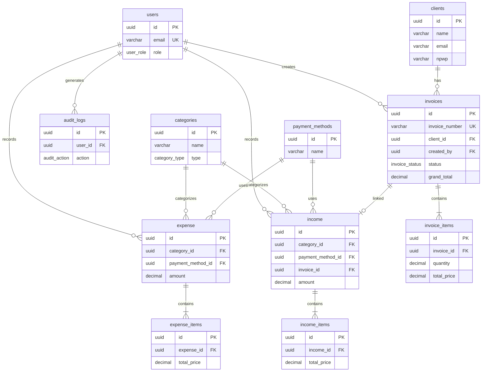
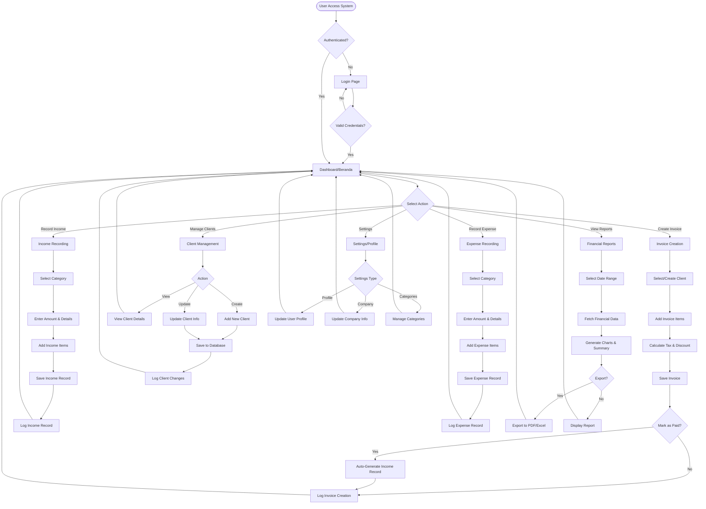
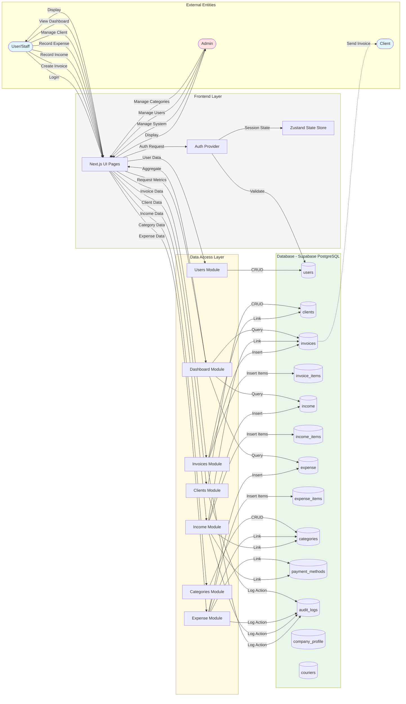

# GMera Solusi - Financial Management System & ERP

## 🌟 About This System

This is a **full-stack web-based Financial Management System and Enterprise Resource Planning (ERP) platform** specifically designed to help small and medium-sized businesses (SMBs) modernize their financial operations. The system eliminates the need for spreadsheets and manual bookkeeping by providing a centralized, cloud-based solution for managing all aspects of business finances.

### 🎯 **What This System Does**

This platform serves as the **complete financial backbone** for businesses, providing:

1. **Financial Accounting & Bookkeeping**
   - Track all income and expenses with detailed categorization
   - Automatic calculation of tax, discounts, and totals
   - Multi-level item tracking for each transaction
   - Attachment support for receipts and documentation

2. **Invoice Management & Billing**
   - Create professional, customizable invoices
   - Automatic invoice numbering system
   - Track invoice status: unpaid, paid, overdue, cancelled
   - Automatic income generation when invoices are paid
   - Client information snapshot for historical accuracy
   - Shipping integration with tracking numbers

3. **Client Relationship Management (CRM)**
   - Centralized client database with complete contact information
   - Transaction history tracking per client
   - Client-specific invoice analytics
   - NPWP (Tax ID) management for Indonesian businesses

4. **Real-Time Financial Dashboard**
   - Live KPI monitoring: total income, expenses, net profit
   - Unpaid invoice tracking and alerts
   - Month-over-month performance comparison
   - Interactive charts and visualizations (Recharts)
   - Recent transaction feed

5. **Advanced Reporting & Analytics**
   - Customizable date range reports
   - Income vs Expense analysis
   - Category-based spending insights
   - Export capabilities (PDF/Excel ready)
   - Profit & loss statements

6. **User Management & Security**
   - Role-based access control (Super Admin, Finance Manager, Accounting Staff, Sales Staff, Viewer)
   - User activity tracking
   - Department-based organization
   - Secure authentication via Supabase Auth

7. **Audit Trail & Compliance**
   - Complete audit log of all financial operations
   - Track who created, modified, or deleted records
   - IP address and user agent logging
   - Before/after value tracking for changes
   - Compliance-ready for financial audits

8. **Company Settings & Configuration**
   - Customizable company profile
   - Tax rate configuration
   - Payment method management
   - Category organization with drag-and-drop ordering
   - Courier/shipping method setup

### 👥 **Who This System Is For**

- **Small to Medium Enterprises (SMEs)** looking to digitize their financial operations
- **Accounting firms** managing multiple client finances
- **Startups** needing professional financial management from day one
- **Business owners** who want real-time visibility into their financial health
- **Finance teams** requiring collaborative financial management tools

### 🏆 **Key Benefits**

- **Eliminates Manual Errors**: Automated calculations and validations
- **Real-Time Insights**: Instant access to financial metrics and trends
- **Scalable**: Grows with your business from startup to enterprise
- **Cloud-Based**: Access from anywhere, anytime
- **Audit-Ready**: Complete financial trail for compliance
- **User-Friendly**: Intuitive interface built with modern UX principles
- **Cost-Effective**: Alternative to expensive enterprise accounting software

### 🛠️ **Technical Architecture**

Built with modern, production-ready technologies:
- **Frontend**: Next.js 15+ (React 19, App Router)
- **Database**: Supabase (PostgreSQL with Row-Level Security)
- **Styling**: Tailwind CSS for responsive design
- **State Management**: Zustand for efficient client state
- **Authentication**: Supabase Auth with JWT tokens
- **Charts**: Recharts for data visualization
- **Icons**: Astraicons (Premium icon set)

---

## 📁 Folder & File Structure

| Path | Description |
|------|-------------|
| `src/app/` | Main Next.js app directory. Contains all pages and layouts for dashboard, authentication, and features. |
| `src/app/(dashboard)/` | Dashboard area: layouts and pages for Beranda, E-Invoice, Klien, Laporan, Pendapatan, Pengeluaran, Pengaturan, Profil. |
| `src/app/login/` | Login page for user authentication. |
| `src/app/forgot-password/` | Password reset page. |
| `src/components/` | All React components. |
| `src/components/layout/` | Navbar, Sidebar, SidebarContext for app layout. |
| `src/components/dashboard/` | Dashboard widgets: FinancialChart, MetricCard, RecentTransactions, UnpaidInvoices. |
| `src/components/ui/` | UI primitives: Button, Modal, Table, Input, Skeleton, Toaster, etc. |
| `src/components/providers/` | React context providers. |
| `src/lib/` | Utility libraries and Supabase integration. |
| `src/lib/db/` | Database access modules: categories, clients, dashboard, expense, income, invoices, users, types. |
| `src/store/` | Zustand stores for authentication and UI state. |
| `src/utils/` | Utility functions. |
| `src/utils/supabase/` | Supabase client and server helpers. |
| `schema/` | Database schema, seeds, and latest `db_dump.sql` for reference. |
| `docs/` | Project documentation, technical specs, and wireframes. |
| `middleware.ts` | Next.js middleware for route protection. |
| `next.config.mjs` | Next.js configuration. |
| `tailwind.config.ts` | Tailwind CSS configuration. |
| `postcss.config.mjs` | PostCSS configuration. |
| `tsconfig.json` | TypeScript configuration. |
| `package.json` | Project dependencies and scripts. |
| `README.md` | This documentation file. |

---

## 🏗️ Installation & Setup

1. **Clone the repository:**
   ```bash
   git clone <repository-url>
   cd "Gmera Solusi V4"
   ```

2. **Install dependencies:**
   ```bash
   npm install
   ```

3. **Configure environment variables:**
   Create `.env.local` and add your Supabase credentials:
   ```env
   NEXT_PUBLIC_SUPABASE_URL=your_supabase_url
   NEXT_PUBLIC_SUPABASE_ANON_KEY=your_supabase_anon_key
   ```

4. **Database setup:**
   - Use the latest schema in `schema/db_dump.sql` to set up your Supabase/PostgreSQL database.

5. **Run the development server:**
   ```bash
   npm run dev
   ```

6. **Open the app:**
   Go to [http://localhost:3000](http://localhost:3000)

---

## 🗂️ Key Features

- **Financial Dashboard:** Real-time KPIs for income, expenses, profit, and invoices.
- **E-Invoicing:** Create/send invoices, auto-calculate tax/discount, track status.
- **Income & Expense Tracking:** Categorized transactions, payment methods, attachments.
- **Client Management:** Centralized client database, transaction history.
- **User Management:** Role-based access, status, and audit logs.
- **Audit Trail:** All critical actions logged for compliance.
- **Reports:** Generate and export financial reports.

---

## 🗃️ Database Reference

The latest database schema is in [`schema/db_dump.sql`](schema/db_dump.sql). Use this as the source of truth for all table structures, relationships, and constraints.

---

## 🗺️ Entity Relationship Diagram (ERD)

The system consists of 13 main database tables with the following relationships:



### 📋 Complete Table Descriptions

<details>
<summary><b>Click to view detailed table schemas</b></summary>

#### **users** - User Management
- `id` (uuid, PK) - User identifier
- `name`, `email` (UK), `role` (user_role enum)
- `phone`, `department`, `avatar_url`
- `is_active`, `last_login`, `created_at`, `updated_at`

#### **clients** - Client Database
- `id` (uuid, PK) - Client identifier
- `name`, `address`, `city`, `province`, `postal_code`
- `phone`, `email`, `npwp` (Indonesian Tax ID)
- `notes`, `is_active`, `created_at`, `updated_at`

#### **categories** - Transaction Categories
- `id` (uuid, PK) - Category identifier
- `name`, `type` (income/expense), `description`
- `is_active`, `order_index`, `created_at`

#### **payment_methods** - Payment Options
- `id` (uuid, PK) - Payment method identifier
- `name`, `is_active`

#### **invoices** - Invoice Management
- `id` (uuid, PK), `invoice_number` (UK)
- `client_id` (FK), `client_name`, `client_address`, `client_phone`, `client_email`
- `invoice_date`, `due_date`, `status` (unpaid/paid/overdue/cancelled)
- `subtotal`, `tax_rate`, `tax_amount`, `shipping_cost`, `discount_amount`, `grand_total`
- `shipping_method`, `tracking_number`, `shipping_address`, `estimated_arrival`
- `notes`, `attachment_url`, `created_by` (FK)
- `created_at`, `updated_at`, `paid_at`

#### **invoice_items** - Invoice Line Items
- `id` (uuid, PK), `invoice_id` (FK)
- `description`, `quantity`, `unit`, `unit_price`, `total_price`

#### **income** - Income Transactions
- `id` (uuid, PK), `date`, `source`
- `category_id` (FK), `payment_method_id` (FK), `invoice_id` (FK)
- `amount`, `reference_number`
- `entry_method` (manual/auto), `status`, `description`
- `attachment_url`, `created_by` (FK)
- `created_at`, `updated_at`

#### **income_items** - Income Line Items
- `id` (uuid, PK), `income_id` (FK)
- `description`, `quantity`, `unit`, `unit_price`, `total_price`

#### **expense** - Expense Transactions
- `id` (uuid, PK), `date`, `expense_type`
- `category_id` (FK), `payment_method_id` (FK)
- `amount`, `reference_number`, `status`, `description`
- `attachment_url`, `created_by` (FK)
- `created_at`, `updated_at`

#### **expense_items** - Expense Line Items
- `id` (uuid, PK), `expense_id` (FK)
- `description`, `quantity`, `unit`, `unit_price`, `total_price`

#### **audit_logs** - Audit Trail
- `id` (uuid, PK), `user_id` (FK)
- `action` (create/update/delete/view/export/login/logout)
- `entity_type`, `entity_id`
- `old_values` (jsonb), `new_values` (jsonb)
- `ip_address`, `user_agent`, `created_at`

#### **company_profile** - Company Settings
- `id` (uuid, PK), `company_name`, `address`, `phone`, `email`
- `npwp`, `logo_url`, `website`
- `bank_name`, `bank_account`, `bank_account_name`
- `tax_rate`, `created_at`, `updated_at`

#### **couriers** - Shipping Methods
- `id` (uuid, PK), `code` (UK), `name`, `type`
- `estimated_days`, `is_active`

</details>

---

## 🔄 System Flowchart



---

## 📊 Data Flow Diagram (DFD)



---

## 📈 Data Flow Description

### 1. Authentication Flow
- User accesses the system → Auth Provider validates credentials against `users` table → Session stored in Zustand → User granted access

### 2. Invoice Management Flow
- User creates invoice → Data sent to Invoices Module → Invoice saved to `invoices` table → Items saved to `invoice_items` table → Client linked via `client_id` → Action logged to `audit_logs` → When marked as paid, income record auto-generated

### 3. Income Recording Flow
- User records income → Data sent to Income Module → Income saved to `income` table → Items saved to `income_items` table → Linked to category via `category_id` → Linked to payment method via `payment_method_id` → Optionally linked to invoice via `invoice_id` → Action logged to `audit_logs`

### 4. Expense Recording Flow
- User records expense → Data sent to Expense Module → Expense saved to `expense` table → Items saved to `expense_items` table → Linked to category and payment method → Action logged to `audit_logs`

### 5. Dashboard Flow
- User views dashboard → Dashboard Module queries `income`, `expense`, `invoices` tables → Data aggregated (totals, charts, KPIs) → Results displayed in UI with charts (Recharts)

### 6. Client Management Flow
- User manages clients → Data sent to Clients Module → CRUD operations on `clients` table → Client data referenced by `invoices` for historical tracking → Actions logged to `audit_logs`

### 7. Audit Trail
- All critical operations (create, update, delete) → Logged to `audit_logs` with user info, timestamps, old/new values, IP address, and user agent

---

## 🛠️ Tech Stack

- **Frontend:** Next.js 15+ (App Router), React 19
- **Styling:** Tailwind CSS
- **Database:** Supabase (PostgreSQL)
- **State Management:** Zustand
- **Icons:** Astraicons (Premium Bold & Linear sets)
- **Charts:** Recharts
- **Authentication:** Supabase Auth

---

## 📄 Documentation & Support

- See the `docs/` folder for technical specs, wireframes, and feature ideation.
- For database details, see `schema/db_dump.sql`.

---

© GMera Solusi. All rights reserved.
