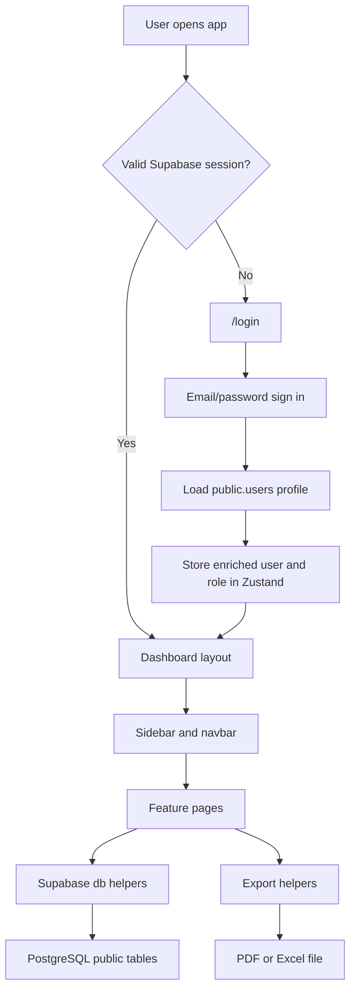
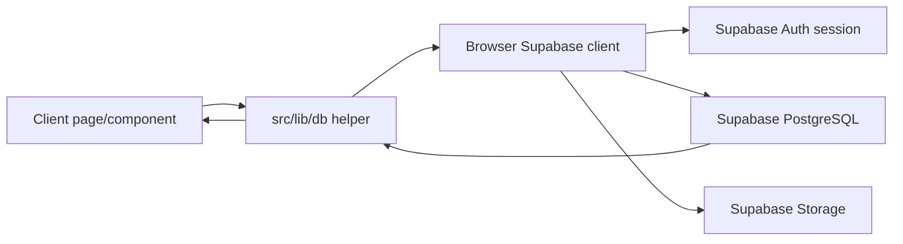
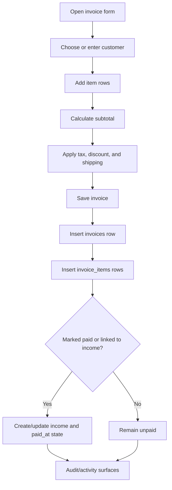
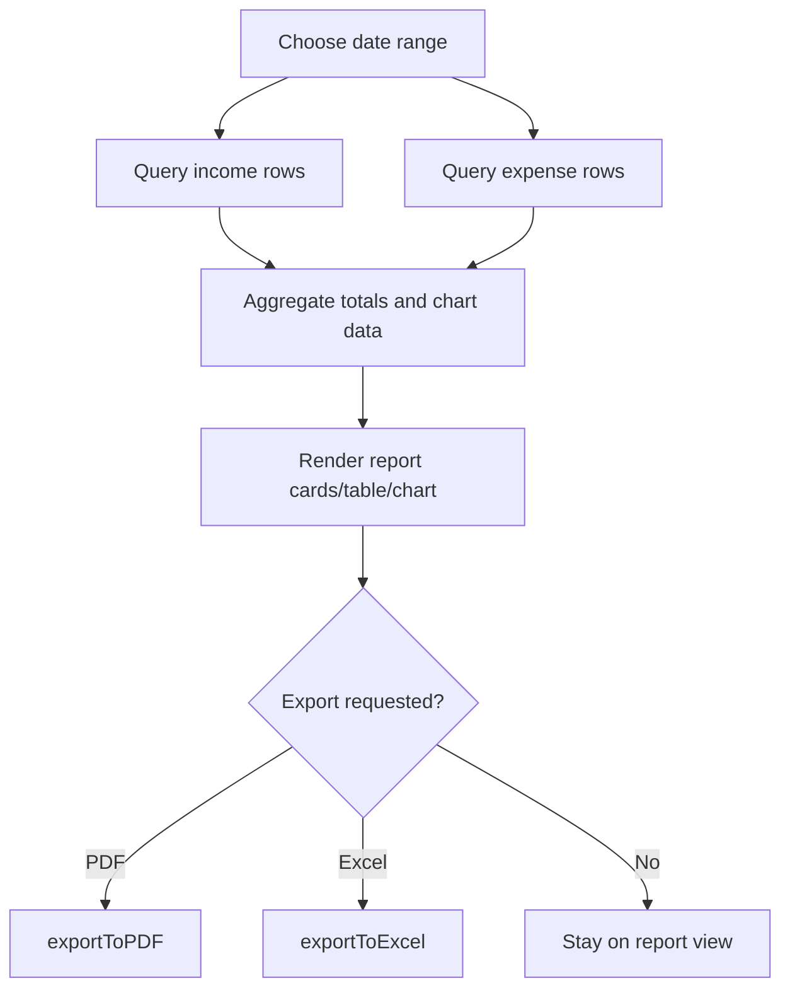
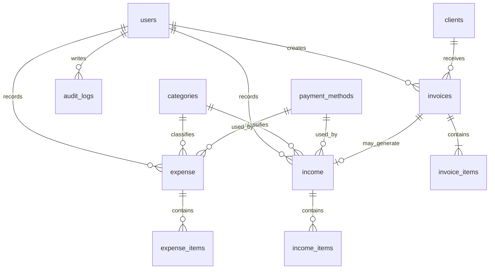

# System Diagrams

Last updated: 2026-06-06.

## Application Flow

```mermaid
flowchart TD
  A["User opens app"] --> B{"Valid Supabase session?"}
  B -->|No| C["/login"]
  C --> D["Email/password sign in"]
  D --> E["Load public.users profile"]
  E --> F["Store enriched user and role in Zustand"]
  B -->|Yes| G["Dashboard layout"]
  F --> G
  G --> H["Sidebar and navbar"]
  H --> I["Feature pages"]
  I --> J["Supabase db helpers"]
  J --> K["PostgreSQL public tables"]
  I --> L["Export helpers"]
  L --> M["PDF or Excel file"]
```

## Data Access Flow

```mermaid
flowchart LR
  Page["Client page/component"] --> Helper["src/lib/db helper"]
  Helper --> Client["Browser Supabase client"]
  Client --> Auth["Supabase Auth session"]
  Client --> DB["Supabase PostgreSQL"]
  Client --> Storage["Supabase Storage"]
  DB --> Helper
  Helper --> Page
```

## Invoice Flow

```mermaid
flowchart TD
  A["Open invoice form"] --> B["Choose or enter customer"]
  B --> C["Add item rows"]
  C --> D["Calculate subtotal"]
  D --> E["Apply tax, discount, and shipping"]
  E --> F["Save invoice"]
  F --> G["Insert invoices row"]
  G --> H["Insert invoice_items rows"]
  H --> I{"Marked paid or linked to income?"}
  I -->|Yes| J["Create/update income and paid_at state"]
  I -->|No| K["Remain unpaid"]
  J --> L["Audit/activity surfaces"]
  K --> L
```

## Reporting Flow

```mermaid
flowchart TD
  A["Choose date range"] --> B["Query income rows"]
  A --> C["Query expense rows"]
  B --> D["Aggregate totals and chart data"]
  C --> D
  D --> E["Render report cards/table/chart"]
  E --> F{"Export requested?"}
  F -->|PDF| G["exportToPDF"]
  F -->|Excel| H["exportToExcel"]
  F -->|No| I["Stay on report view"]
```

## Entity Relationship Overview

```mermaid
erDiagram
  users ||--o{ invoices : creates
  users ||--o{ income : records
  users ||--o{ expense : records
  users ||--o{ audit_logs : writes
  clients ||--o{ invoices : receives
  categories ||--o{ income : classifies
  categories ||--o{ expense : classifies
  payment_methods ||--o{ income : used_by
  payment_methods ||--o{ expense : used_by
  invoices ||--|{ invoice_items : contains
  invoices ||--o| income : may_generate
  income ||--o{ income_items : contains
  expense ||--o{ expense_items : contains
```
