# Diagram Sistem Pengelolaan Keuangan PT GMera Solusi

---

## ALUR FLOWCHART BISNIS

### 1. Flowchart Bisnis Pengelolaan Pendapatan Perusahaan Saat Ini

```mermaid
flowchart TD
    A([Mulai]) --> B["Customer melakukan pemesanan produk\nkepada PT GMera Solusi sesuai\nkebutuhan yang diinginkan"]
    B --> C["Admin keuangan menerima informasi pesanan\ndari customer kemudian melakukan\npengecekan detail pesanan dan harga produk"]
    C --> D["Admin keuangan membuat invoice pembayaran\nsebagai bukti transaksi dan dasar\npenagihan kepada customer"]
    D --> E["Invoice yang telah dibuat dikirimkan\nkepada customer untuk dilakukan\nproses pembayaran"]
    E --> F["Customer melakukan pembayaran sesuai\nnominal yang tercantum pada invoice,\nbaik secara penuh maupun bertahap"]
    F --> G["Admin keuangan meneruskan informasi\npesanan kepada supplier atau pihak ketiga\nyang memproduksi barang"]
    G --> H["Supplier memproses pembuatan pesanan\nkemudian melakukan pengiriman\nbarang kepada customer"]
    H --> I["Admin keuangan melakukan pencatatan\ntransaksi penjualan dan pembayaran\nke dalam Microsoft Excel"]
    I --> J["Data transaksi digunakan oleh admin\nkeuangan untuk menyusun laporan\npenjualan perusahaan secara berkala"]
    J --> K["Laporan penjualan diserahkan kepada\npemilik perusahaan untuk diperiksa\ndan diverifikasi"]
    K --> L([Proses pengelolaan penjualan\ndan pendapatan selesai])
```

### 2. Flowchart Bisnis Pengelolaan Pengeluaran Perusahaan Saat Ini

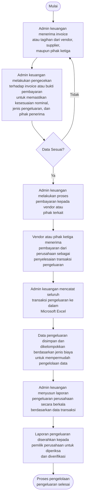

### 3. Flowchart Bisnis Penerbitan Invoice Perusahaan Saat Ini (Manual)

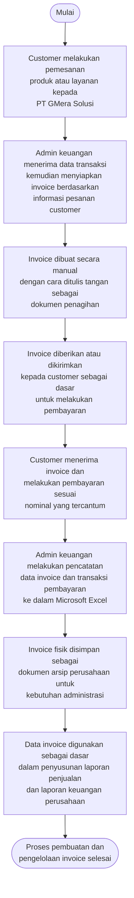

---

## USE CASE DIAGRAM

### Use Case Sistem Pengelolaan Keuangan PT GMera Solusi

> Berdasarkan codebase, sistem memiliki 5 role: `super_admin`, `finance_manager`, `accounting_staff`, `sales_staff`, dan `viewer`. Untuk penyederhanaan sesuai permintaan, dikelompokkan menjadi 3 aktor utama: **Super Admin**, **Finance (finance_manager & accounting_staff)**, dan **Viewer (viewer & sales_staff)**.

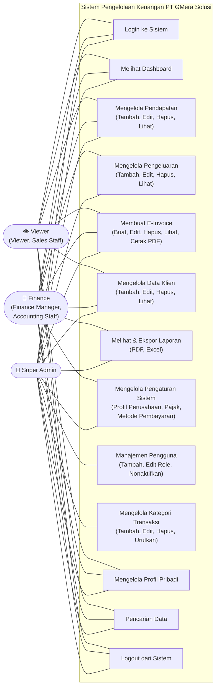

#### Keterangan Hak Akses per Role (Berdasarkan Sidebar.tsx & Pengaturan)

| Fitur | Super Admin | Finance Manager | Accounting Staff | Sales Staff | Viewer |
|---|:---:|:---:|:---:|:---:|:---:|
| Dashboard (Beranda) | ✅ | ✅ | ✅ | ✅ | ✅ |
| Pendapatan | ✅ | ✅ | ✅ | ✅ | ✅ |
| Pengeluaran | ✅ | ✅ | ✅ | ❌ | ✅ |
| E-Invoice | ✅ | ✅ | ✅ | ✅ | ✅ |
| Laporan | ✅ | ✅ | ✅ | ❌ | ✅ |
| Klien | ✅ | ✅ | ✅ | ✅ | ✅ |
| Pengaturan | ✅ | ✅ | ❌ | ❌ | ❌ |
| Profil | ✅ | ✅ | ✅ | ✅ | ✅ |

---

## ACTIVITY DIAGRAM

### 1. Activity Diagram Login

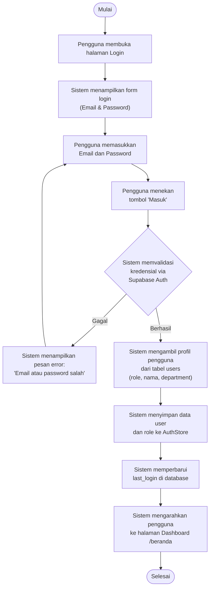

### 2. Activity Diagram Dashboard

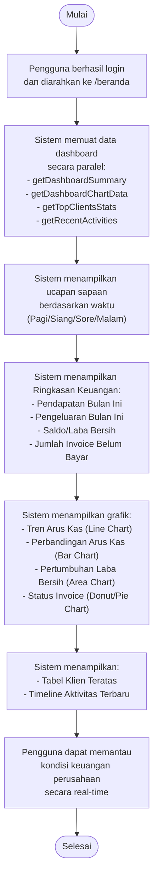

### 3. Activity Diagram Pengelolaan Pendapatan

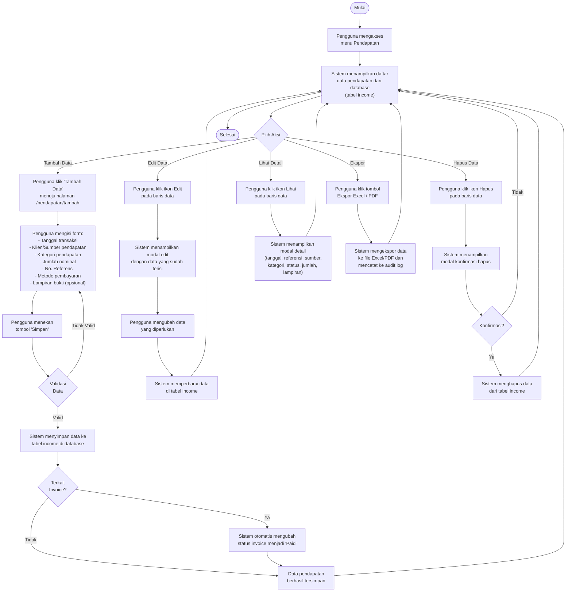

### 4. Activity Diagram Pengelolaan Pengeluaran

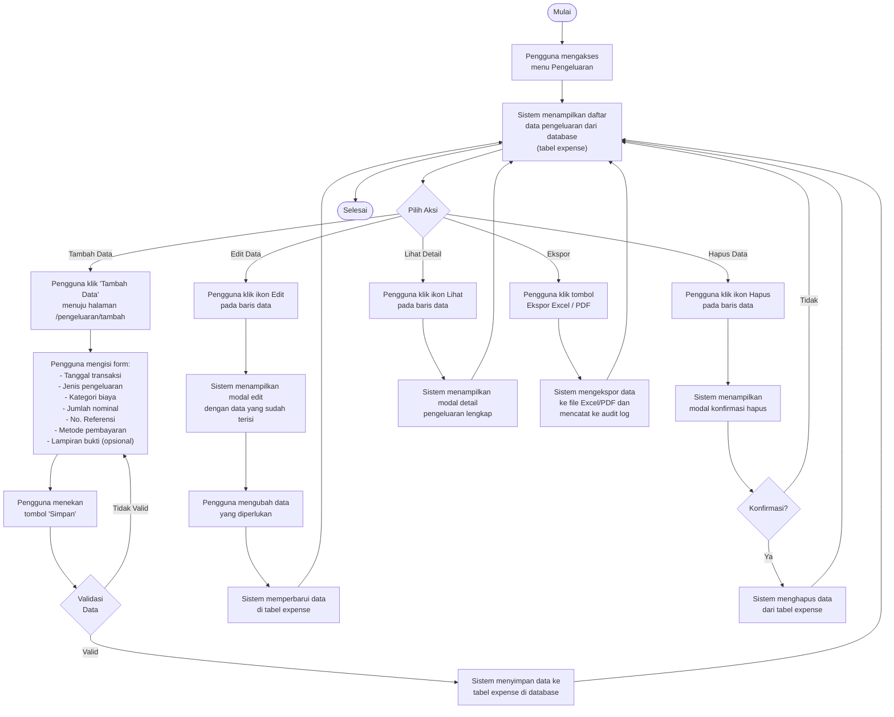

### 5. Activity Diagram Penerbitan E-Invoice

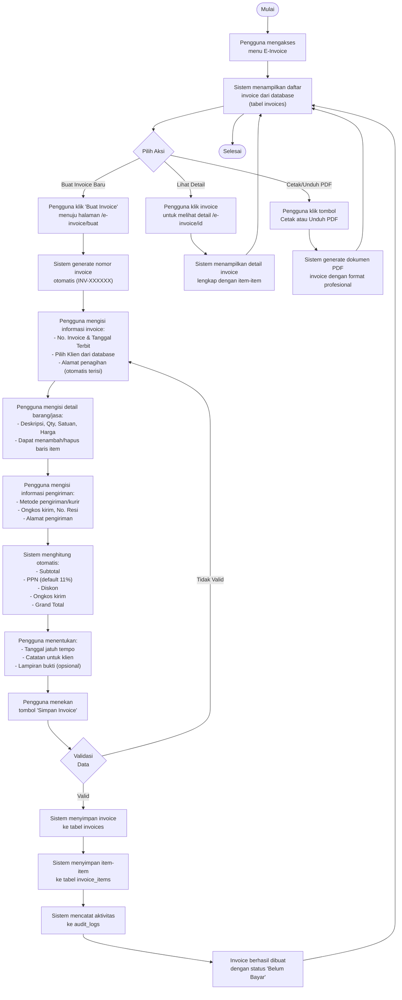

### 6. Activity Diagram Pengelolaan Data Klien

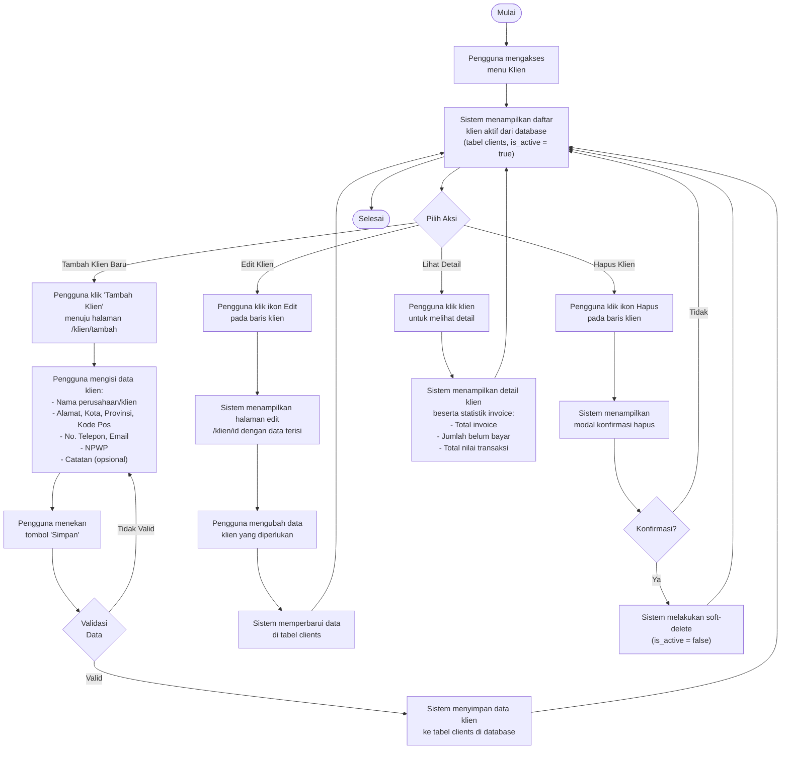

### 7. Activity Diagram Pengelolaan Laporan

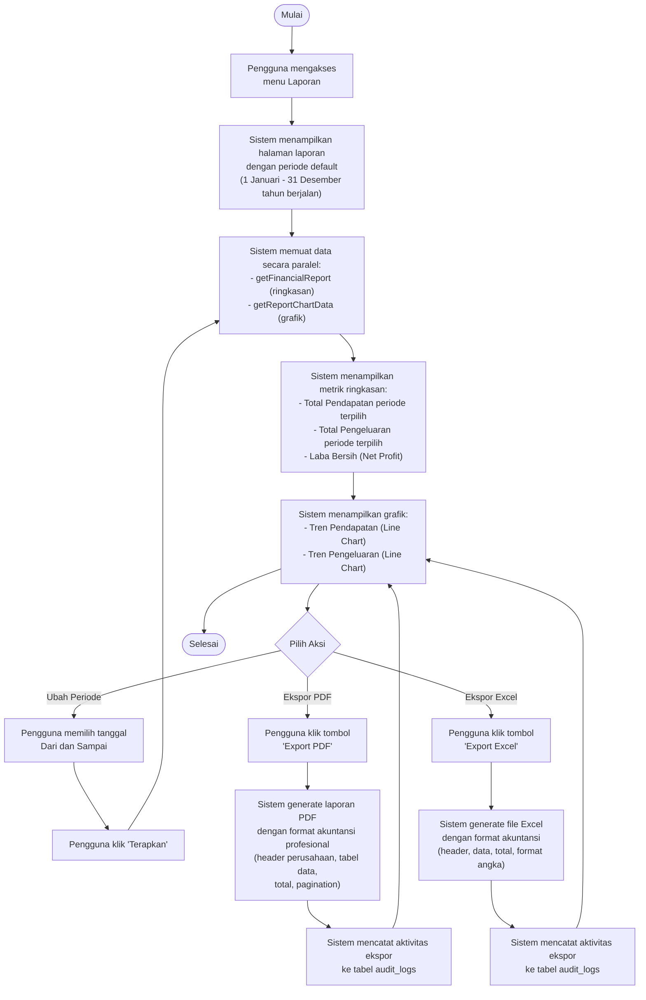

---

## Catatan Verifikasi Kesesuaian dengan Codebase

| Aspek | Deskripsi Bisnis | Implementasi Sistem | Status |
|---|---|---|:---:|
| Pencatatan Pendapatan | Dicatat manual di Excel | Disimpan di tabel `income` via Supabase | ✅ Sesuai |
| Pencatatan Pengeluaran | Dicatat manual di Excel | Disimpan di tabel `expense` via Supabase | ✅ Sesuai |
| Pembuatan Invoice | Ditulis tangan manual | E-Invoice digital via form `/e-invoice/buat` | ✅ Sesuai |
| Penyusunan Laporan | Disusun manual dari Excel | Otomatis via halaman `/laporan` + ekspor PDF/Excel | ✅ Sesuai |
| Penyimpanan Arsip | Invoice fisik disimpan manual | Tersimpan digital di database + attachment Supabase Storage | ✅ Sesuai |
| Verifikasi Pemilik | Laporan diserahkan manual | Dashboard real-time + role Viewer untuk monitoring | ✅ Sesuai |
| Role Pengguna | 3 aktor utama | 5 role: super_admin, finance_manager, accounting_staff, sales_staff, viewer | ✅ Sesuai |
| Kategori Transaksi | Dikelompokkan manual | Tabel `categories` dengan tipe income/expense | ✅ Sesuai |
| Metode Pembayaran | - | Tabel `payment_methods` (Transfer, Tunai, QRIS, dll.) | ✅ Sesuai |
| Audit Trail | Tidak ada | Tabel `audit_logs` mencatat semua aktivitas | ✅ Sesuai |
